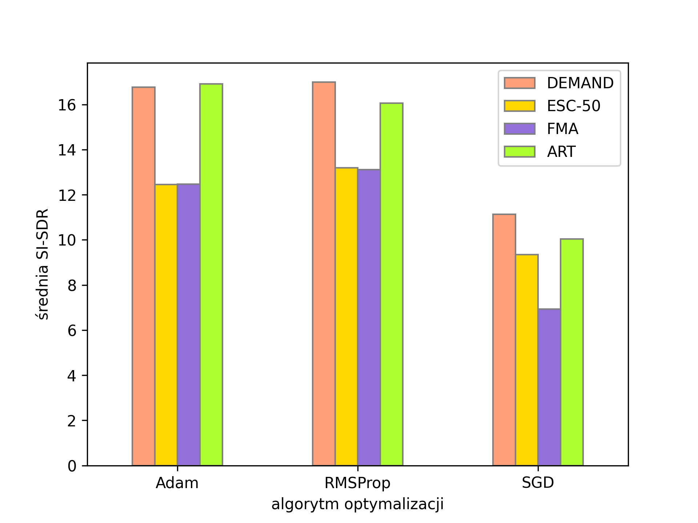

<h1> Audio noise reduction using neural networks </h1>

A research project regarding the efficiency of Wavenet-based convolutional neural networks in the task of noise reduction from speech recordings.

This project consists of sets of Python scripts. They've been grouped into directories based on their functions, and these are the following:
- creating new datasets, by transforming and combining existing ones ([`datasets/`](datasets/))
- training and evaluating neural network models ([`model_management/`](model_management/))
- a GUI application intended to visually asses the efficiency of denoising ([`gui_app/`](gui_app/))
- additional scripts, used to create plots and LaTeX tables ([`thesis_scripts/`](thesis_scripts/))

## Table of contents

- [Table of contents](#table-of-contents)
- [Wavenet implementation](#wavenet-implementation)
- [GUI Application](#gui-application)
- [Dataset management](#dataset-management)
  - [Currently supported datasets](#currently-supported-datasets)
    - [Speech](#speech)
    - [Noise](#noise)
    - [Artificial noise](#artificial-noise)
- [Model management](#model-management)
- [Additional scripts](#additional-scripts)

## Wavenet implementation

The chosen implementation of Wavenet was described in ["A Wavenet for Speech Denoising"](https://arxiv.org/abs/1706.07162) by Rethage et al. Its code was obtained from the original authors' repository ([drethage/speech-denoising-wavenet](https://github.com/drethage/speech-denoising-wavenet)).

The code was modernized to work with Python3 and current versions of Tensorflow and Keras. It was also extended with new features, such as new loss function, dropout layers and a model without conditioning input and related layers.

It can be found inside [speech_denoising_wavenet/](speech_denoising_wavenet/) directory and works as a Python module, used throught the rest of the project.

## GUI Application

Initially, [Audacity](https://www.audacityteam.org/) was used to manually inspect files denoised by neural network models. Because the fact, that it required a lot repetetive work to prepare files for inspection, a custom application was developed. 

This application has a graphical user interface (made with PyQt5) and is integrated with the Wavenet module, which allows for seamless swapping of models or audio files.

Results of denoising and their clean reference can be compared as waveforms or as spectrograms. The current domain of comparison is selected using tabs at the top of the visual (right) panel.

To compare the results, a user must first load an audio file (which needs to have a clean counterpart), and choose a model session (directories with weights generated by the Wavenet module). Then, weights file must be selected. A user may select the weights with the lowerst loss value, the latest weights or choose a specific file. Then, the `Run prediction` button performs inference, and the results are displayed on the right. The model stays loaded in memory, which allows for easy comparison of multiple files.

If the `Calculate metrics` checkbox is on, then metrics from the Speechmetrics package are additionally calculated and displayed in the standard output. 

## Dataset management

Datasets used in the project were generated by combining existing speech datasets and noise datasets. In order to perform this operation, the original datasets must be first converted into an 'intermediate' form. The exact conversion steps are dependent on the form of each datasets.

### Currently supported datasets

#### Speech
- VCTK Corpus
- Mozilla CommonVoice (PL)
#### Noise
- DEMAND
- ESC-50
- FMA

#### Artificial noise
Datasets using artificial noise (white, pink and blue noise) are generated using only the intermediate speech datasets, since these kinds of noise may be generated with code.

## Model management

These scripts allow for training and evaluation of models. 

`batch_train.py` and `batch_eval.py` scripts have functions suited for specific research scenarios and probably need to be adjusted regarding filepaths and config parameters.

`evaluation.py` contains code which acts as an 'engine' of model evaluation on a specific file and/or entire dataset.
 
## Additional scripts

Scripts inside the `thesis_scripts` directory were used to create specific plots and tables. They include local paths, which need to be adjusted before usage. Despite this fact, I've decided to include in them in the repository, since they might still be a useful reference.

A few example plots generated using these scripts are presented below (labels and legend are in Polish):

